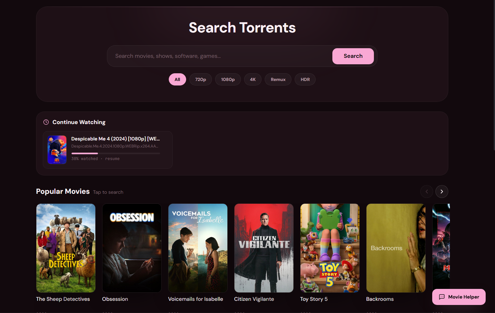
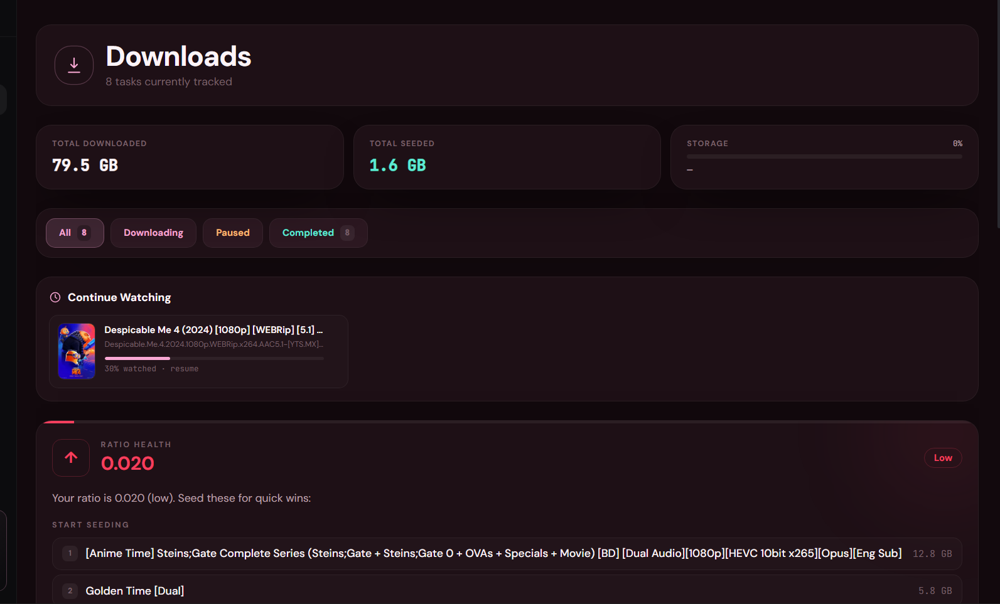
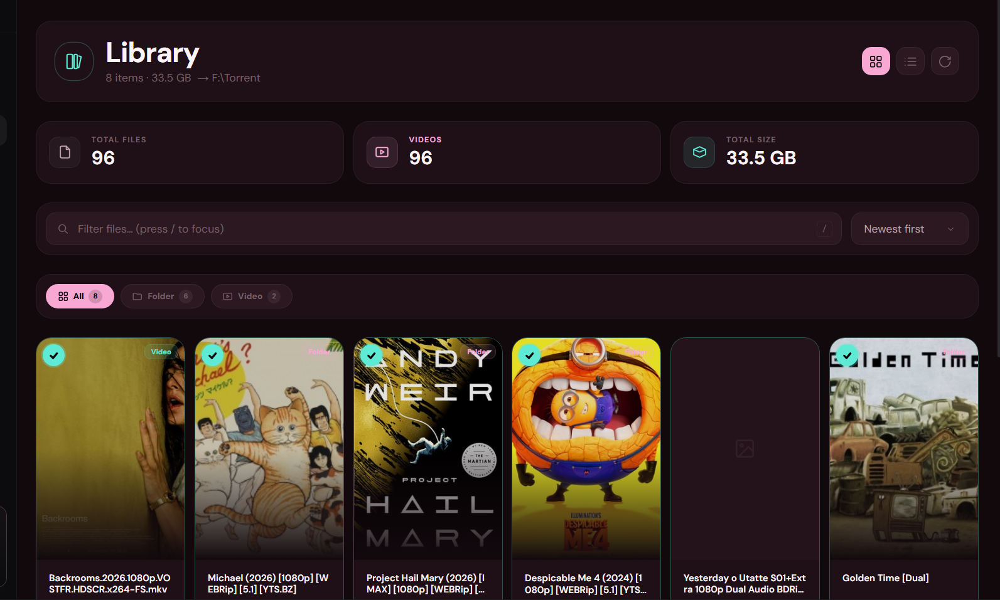

# 🌀 Vortex

[](LICENSE)
[](https://nextjs.org)
[](https://webtorrent.io)
[](https://firebase.google.com)
[](#-self-hosting)

**A self-hosted download manager with a streaming dashboard.** Vortex pairs a beautiful, cloud-accessible web UI with a local engine that runs entirely on your own machine — so you get a modern dashboard you can open from any device, while every file stays on your hardware. Search, download, stream-while-downloading, auto-subtitles, and a media library — all yours, all local.

> **Local-first by design.** Vortex hosts, serves, and streams nothing itself. The engine runs on *your* computer; your files live on *your* disk. The cloud only syncs your settings and library index across your devices.

<!-- 📸 SCREENSHOT: replace with a wide hero shot of the dashboard (Search or Downloads page) -->
<p align="center">
  
</p>

---

## ✨ Features

- ⚡ **WebTorrent engine** — high-speed, memory-efficient downloading and seeding, running locally.
- 🎬 **Stream while downloading** — start watching before a file finishes; 4K/x265 is transcoded to play right in your browser.
- 💬 **Automatic subtitles** — fetches matching subtitles from OpenSubtitles when a download completes.
- 🔍 **Multi-source search** — one search box across several public indexers at once.
- 🖼️ **Poster art & metadata** — automatic artwork and details for movies and shows (TMDB, with free fallbacks).
- ☁️ **Cross-device sync** — sign in with Google; your settings and library index follow you, powered by Firebase.
- 📊 **Library & ratio tracking** — organized media library, seeding stats, and a ratio coach.
- 🎨 **12 built-in themes** — Terminal, Synthwave, Aurora, Sakura, and more; switch instantly.
- 🔒 **Private & local** — files never touch a server you don't control.

<!-- 📸 SCREENSHOT: a 2x2 grid or a few shots — Downloads, Library, Settings (themes), the streaming player -->
<p align="center">
  
  
</p>

---

## 🏗️ How it works

Vortex has two pieces:

1. **Dashboard (web)** — a Next.js app (deployable to Vercel or any Node host) that handles the UI: searching, library management, streaming player, and settings. It talks to your local engine.
2. **Engine (local)** — a small standalone server that runs on *your* machine and does the actual downloading, seeding, transcoding, and file management. It listens on `localhost:3001` and the dashboard connects to it.

```
┌──────────────────┐        ┌───────────────────────────┐
│  Vortex Dashboard│  HTTPS │  Your device               │
│  (Next.js / web) │◀──────▶│  Vortex Engine (localhost) │
│  search • library│        │  WebTorrent • files • disk │
└──────────────────┘        └───────────────────────────┘
        ▲
        │ settings + library index only
        ▼
   Firebase (your project)
```

You get the best of both: a polished, cloud-accessible dashboard, with the privacy and speed of downloading locally.

---

## 🚀 Self-hosting

Vortex is meant to be self-hosted. You bring your own Firebase project and (optionally) your own deployment of the dashboard.

### 1. Clone & install

```bash
git clone https://github.com/Rover1218/vortex.git
cd vortex
npm install
```

### 2. Configure

Copy `.env.example` to `.env.local` and fill in your own **Firebase** keys (create a free project at [console.firebase.google.com](https://console.firebase.google.com), enable Google sign-in and Firestore).

Optional keys for extra features: a free [TMDB](https://www.themoviedb.org/settings/api) key for the best posters, and a free [OpenSubtitles](https://www.opensubtitles.com/consumers) key for subtitles. Everything else works without them.

### 3. Run it locally

```bash
npm run dev:full   # runs the dashboard + engine together
```

Open `http://localhost:3000`, sign in with Google, and you're downloading.

### 4. (Optional) Deploy the dashboard

The dashboard deploys to Vercel in a click — connect the repo and add your Firebase env vars. The engine always stays on your own machine.

---

## 📦 Building the desktop engine

To produce the standalone Windows engine (`vortex.exe`) with your own credentials baked in:

```bash
npm run build:engine:exe   # output in public/downloads/vortex.exe
```

Because the engine is an unsigned executable that opens many peer-to-peer connections, Windows SmartScreen or antivirus may warn on first run — click **More info → Run anyway**, or build it yourself from source (above) so you know exactly what's inside.

---

## 🧰 Tech stack

- **Frontend:** Next.js 16 (App Router), React 19, Tailwind CSS, Framer Motion
- **Engine:** Node.js, [WebTorrent](https://webtorrent.io), Express, ffmpeg (transcoding)
- **Auth & sync:** Firebase Auth (Google) + Firestore
- **Desktop:** Electron + electron-builder

---

## 💛 Support the project

Vortex is free and open source (AGPL-3.0). There's an **optional** paid tier that unlocks convenience features (uncapped speed, unlimited simultaneous downloads, auto-subtitles, a release calendar) and helps fund development — but the core is fully usable for free, and if you self-host you configure it however you like. See the in-app upgrade page for details.

---

## 🤝 Contributing

Issues and pull requests are welcome. If you're filing a bug, include your OS, Node version, and steps to reproduce. If you're adding a feature, open an issue first so we can talk through the approach.

---

## ⚖️ Legal

Vortex is a general-purpose download and media-management tool. It does not host, provide, or distribute any content. **You are responsible for what you download and for complying with the laws of your country and the rights of copyright holders.** Use it for Linux ISOs, public-domain media, your own files, and other lawful content.

---

## 📜 License

[GNU AGPL-3.0](LICENSE) © Anindya Kanti Das. If you run a modified version as a network service, you must make your source available under the same license.
